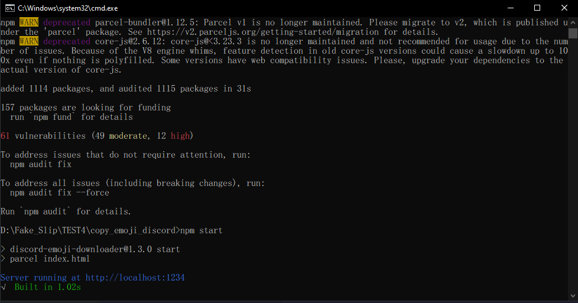

# copy_emoji_discord

### Requirements

* nodejs version 20.9.0 
Recommended or more version

#### install

    npm install parcel-bundler --save-dev

#### run

    npm start

#### Copy server running at ......

    http://localhost:1234

and then past in google chorme or other web browser

#### Enjoy!

**[Website](https://thatiemsz.github.io/Discord-Emoji-Downloader)**